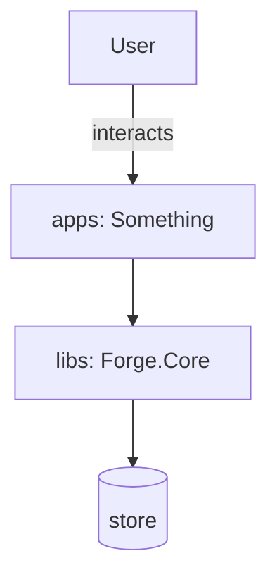

# Spec Kit — /speckit.plan

## User Input

```text
${input:feature:The feature slug to plan (must already have specs/<feature>/spec.md)}
```

You are producing the **technical design** for an existing spec in the Forge workshop repo.
Follow the auto-loaded constitution (`.github/instructions/constitution.instructions.md`).

## Steps

1. **Read `specs/<feature>/spec.md` in full.** If it does not exist, stop and tell the user
   to run `/speckit.specify` first. Do not invent a spec.

2. **Resolve the registry** — read `.github/domains.yaml` for every affected domain: `kind`,
   `tier`, `source`, `tests`, `project`, `build`, `test_cmd`. Never guess a path or command.

3. **Resolve every `[NEEDS CLARIFICATION]`** in the spec. If any would change the design,
   ask the user (up to 3 targeted questions, one at a time, each with a recommended answer
   and 2–5 options). Do not design around an unresolved blocking ambiguity.

4. **Design validation** — before writing the plan:
   - Walk `.github/checklists/<kind>-design-checklist.md` for each affected kind. Confirm
     the design has an answer for each applicable item.
   - Confirm the design satisfies §IV (code quality, async, DI, determinism), §V (security,
     input validation, no secrets), and §VI (testing at the task's tier).
   - Confirm no real domain will depend on `spike/**` (§XI).
   - Confirm shared types land in `libs/` rather than being duplicated or reached across.

5. **Prefer the smallest viable design.** Record rejected alternatives briefly — one line
   each, with why. A design with no rejected alternatives usually means you only had one
   idea.

6. **Write** `specs/<feature>/plan.md` using the template below.

## plan.md Template

```markdown
# Plan: <Feature Title>

Spec: `specs/<feature>/spec.md`

## Approach
<2–5 sentences. The shape of the solution and why this shape.>

## Tier
**TIER: <highest>** (determined by `<path>`) — requires: <approval / test-first / reviewer>

## Domain Breakdown
| Domain id | Kind | Tier | Paths to touch | Build | Test |
|---|---|---|---|---|---|
| <id> | <kind> | <n> | `<source>`, `<tests>` | `<build>` | `<test_cmd>` |

Scaffolding needed: <none | `scaffold-domain -Id ... -Kind ... -Name ...`>

## Design

### Components
<what gets created or changed, and where each piece lives>

### Contracts
<public surfaces, endpoints, CLI arguments, message shapes. For `libs/**`, call out that
this is a contract and name the consumers.>

### Data
<models, persistence, migrations. Skip if none.>

## Diagrams



## Constitution Check
- §IV code quality: ok | <concern>
- §V security: ok | <concern>
- §VI testing: ok | <concern>
- §I/§XI boundaries (no cross-domain internals, no spike dependency): ok | <concern>

## Design Checklist
- [<kind>] clean | <items needing attention> (`.github/checklists/<kind>-design-checklist.md`)

## Testing Strategy
- Tier 1 domains: which contracts get a **failing test first**, and the test names
- Tier 2 domains: which logic paths get tests; what (if anything) is `exempt` and why
- Commands that will be run, taken from the registry

## Alternatives Rejected
- **<option>** — <why not, in one line>

## Risks
| Risk | Mitigation / verification |
|---|---|
| <...> | <...> |
```

## Rules

- **Resolve commands from the registry, never from memory.**
- **No implementation code in the plan.** Interfaces and signatures are fine; bodies are
  not.
- **If the design cannot satisfy a constitution section, that is a design risk to resolve
  now** — not a surprise for the builder to discover.
- **Name the failing tests for Tier 1 work here.** If you cannot name them at design time,
  the contract is not pinned down enough.

Next step: `/speckit.tasks`.
