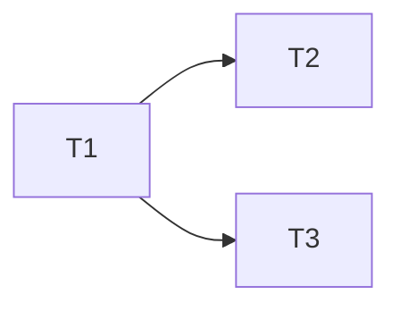

# Spec Kit — /speckit.tasks

## User Input

```text
${input:feature:The feature slug to decompose (must already have specs/<feature>/plan.md)}
```

You are decomposing an approved design into **independently buildable and reviewable
tasks** for the Forge workshop repo. Follow the auto-loaded constitution
(`.github/instructions/constitution.instructions.md`).

## Steps

1. **Read `specs/<feature>/spec.md` and `specs/<feature>/plan.md` in full.** If the plan is
   missing, stop and tell the user to run `/speckit.plan` first.

2. **Resolve the registry** (`.github/domains.yaml`) for each affected domain: `tier`,
   `source`, `tests`, `build`, `test_cmd`, `builder`, `reviewer`.

3. **Decompose.** Every task must be:
   - **Single-domain.** A task that needs two domains is two tasks. No exceptions — builders
     are hard-scoped (§I).
   - **Independently reviewable.** A reviewer must be able to reach a verdict on it without
     waiting for a later task.
   - **Testable.** Name the test expectation, not "add tests".
   - **Small enough to finish.** If a task's deliverable takes more than one sentence to
     describe, split it.

4. **Order by dependency.**
   - Scaffolding (`scaffold-domain`) comes first — nothing can be built into an
     unregistered domain.
   - `libs/` tasks come before the domains that consume them.
   - Identify what can run in **parallel**: tasks in different domains with no dependency.

5. **Tag every task** with domain, tier, builder, reviewer, and files likely touched.

6. **Write** `specs/<feature>/tasks.md` using the template below.

## tasks.md Template

```markdown
# Tasks: <Feature Title>

Spec: `specs/<feature>/spec.md` · Plan: `specs/<feature>/plan.md`

**TIER (highest): <n>** — requires: <approval / test-first / reviewer>

## Task List

### T1 — <deliverable>
- **Domain:** `<id>` (`<kind>`, tier `<n>`)
- **Files:** `<paths from the registry>`
- **Depends on:** none | T<n>
- **Test expectation:** <the specific behavior a test must pin — name the test if Tier 1>
- **Builder / Reviewer:** `<builder>` (`claude-opus-4.8`) / `<reviewer>` (`gpt-5.6-sol`)
- **Done when:** <observable condition, not "code written">

### T2 — ...

## Dependency Graph



## Parallelizable
T<n>, T<n> — <why they do not conflict>

## Gate Summary
| Task | Tier | Pre-edit approval | Test-first | Reviewer |
|---|---|---|---|---|
| T1 | <n> | required / n/a | required / logic-only / n/a | `<reviewer>` / none |
```

## Rules

- **One domain per task.** This is the rule that makes the whole orchestration work. A
  cross-domain task will be rejected by the builder.
- **Scaffolding is a real task**, with its exact command:
  `scaffold-domain -Id <id> -Kind <kind> -Name <Name>`.
- **"Add tests" is not a task.** Tests are part of the task that changes the behavior —
  at Tier 1 they come *first* within it.
- **"Done when" must be observable.** "Implemented" is not a condition; "`GET /x` returns
  404 for an unknown id, covered by `GetById_UnknownId_ReturnsNotFound`" is.
- **Do not exceed what the plan specified.** If decomposition reveals a gap, say so and go
  back to `/speckit.plan` rather than inventing scope here.

Next step: `/speckit.implement`.
