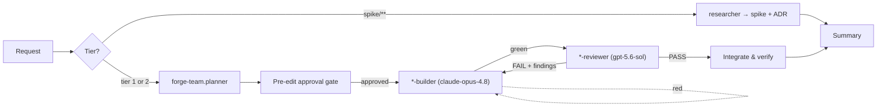

# Forge

A **workshop repository** — a growing collection of desktop applications, services,
libraries, tools, and scripts built to learn and test things, plus the useful automation
that accumulates along the way.

It is not a product. There is no release train. What there is instead is a set of
independent domains at different levels of maturity, and the machinery to keep the useful
ones honest and the throwaway ones cheap.

## Layout

| Root | Kind | Tier | Contains |
|---|---|---|---|
| `apps/` | `app` | 2 | Desktop applications — WinUI 3, WPF, console UX |
| `services/` | `service` | 1 | Long-running services and APIs — ASP.NET Core, workers |
| `libs/` | `lib` | 1 | Shared libraries — highest blast radius |
| `tools/` | `tool` | 2 | Developer tooling — CLIs, generators, analyzers |
| `scripts/` | `script` | 2 | PowerShell automation |
| `spike/` | `spike` | 0 | Throwaway experiments — one question each |

A **domain** is one immediate child of one of those roots. Every domain is registered in
[`.github/domains.yaml`](.github/domains.yaml), which is the authoritative source for its
paths, tier, and build/test commands.

## Rigor tiers

Process is keyed to **where code lives**, not to how a request was phrased. You cannot
downgrade rigor by calling something a quick experiment.

| Tier | Paths | Pre-edit approval | Test-first | Independent reviewer |
|---|---|---|---|---|
| **1 — Full** | `services/**`, `libs/**` | Required | **Required** (failing test first) | Required |
| **2 — Standard** | `apps/**`, `tools/**`, `scripts/**` | Required | Required for logic | Required |
| **0 — Spike** | `spike/**` | No | No | No |

Code quality, security, and "it must build" apply at **every** tier — including spikes.

## Multi-agent workflow

Work runs through a plan → build → review → iterate loop, with builders and reviewers on
**different model families** so a review cannot rubber-stamp its own reasoning.



| Agent | Role |
|---|---|
| `forge-team` | Orchestrator — owns the loop and the quality bar |
| `forge-team.planner` | Decomposes a request into ordered, tier-labelled tasks |
| `app-builder` / `app-reviewer` | `apps/**` |
| `service-builder` / `service-reviewer` | `services/**`, `libs/**` |
| `tooling-builder` / `tooling-reviewer` | `tools/**`, `scripts/**` |
| `researcher` | Investigates a question → spike + ADR |

Builders are **parameterized by domain**: the orchestrator passes a domain id and the
builder resolves its own paths from the registry. Adding a project needs no new agent —
just a registry row.

For a focused single-domain change, use the
[single-agent workflow](.github/instructions/single-agent-workflow.instructions.md)
instead. Same gates, fewer hand-offs.

## Adding a domain

Never create a project folder by hand — an unregistered domain is a blocking error for
every builder.

```powershell
# Always preview first
.\.github\skills\scaffold-domain\scripts\New-ForgeDomain.ps1 `
    -Id clipboard-history -Kind app -Name ClipboardHistory -WhatIf

# Then apply
.\.github\skills\scaffold-domain\scripts\New-ForgeDomain.ps1 `
    -Id clipboard-history -Kind app -Name ClipboardHistory
```

This creates the folder, README, project and test scaffolding, the `Forge.sln` entry, and
the registry row in one step. Afterwards: fill in the README and update
`memory-bank/progress.md`.

**Pick the root deliberately** — it decides the tier, permanently. The question that
matters is: *are you building this to keep, or to learn?* "Learn" means `spike/`.

## Build and test

```powershell
dotnet build Forge.sln
dotnet test Forge.sln
dotnet csharpier check .
Invoke-ScriptAnalyzer -Path scripts -Recurse -Severity Error
```

Per-domain commands come from `.github/domains.yaml`. Spikes are excluded from the
solution by design, so they never break a repo-wide build.

## First-time setup

```powershell
dotnet new tool-manifest
dotnet tool install csharpier
Install-Module PSScriptAnalyzer -Scope CurrentUser
Install-Module Pester -MinimumVersion 5.0 -Scope CurrentUser
```

## Where things are written down

| Document | Answers |
|---|---|
| [`.github/instructions/constitution.instructions.md`](.github/instructions/constitution.instructions.md) | The rules. Wins every disagreement. |
| [`.github/domains.yaml`](.github/domains.yaml) | Where each domain is, its tier, how to build and test it |
| [`.github/copilot-instructions.md`](.github/copilot-instructions.md) | Which mode and which agent to use |
| [`.github/agents/README.md`](.github/agents/README.md) | The agent roster and how to drive it |
| [`docs/adr/`](docs/adr/) | **Why** things are the way they are |
| [`memory-bank/progress.md`](memory-bank/progress.md) | **What** exists and what state it is actually in |

## Conventions

- **Commits:** local commits are yours. The one thing that must conform is the **title of a
  PR into `main`** (squash-merged, so it becomes the permanent commit):
  `<type>(<domain-id>): <imperative subject>` — e.g. `feat(ledger): add idempotent posting`.
- **Work items:** GitHub issues on `jacen555/demo`, labelled by kind.
- **Spikes graduate by rewrite**, not by moving the folder. A spike proves the approach; the
  real thing is built under the gates the spike skipped.
